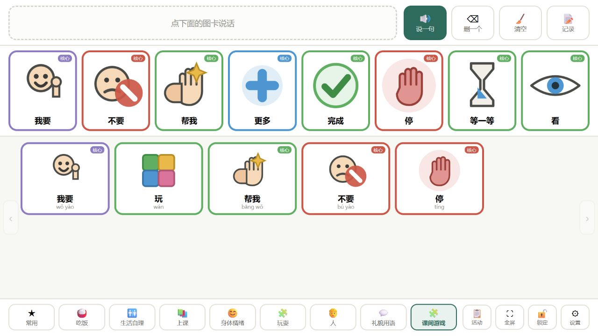
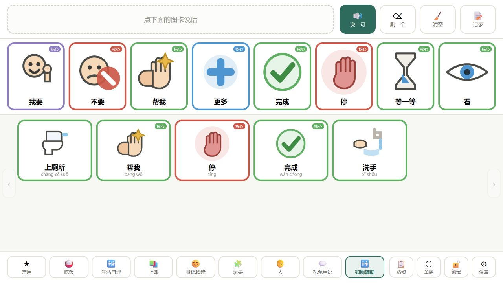

# AAC 活动本位辅助沟通平台（研究原型 v0.3）

一个**以"活动"为单位**的辅助沟通（AAC）平台原型：学生端只保留沟通板本身，教师端负责图卡、活动、使用统计与观察报告。

本仓库是论文《活动本位视角下AAC符号系统AI辅助设计的理论建构》第四章"系统设计"的原型实现，用于呈现设计逻辑的可实现性（设计论证工具，不是应用效果验证工具）。

> **一句话说明**：学生端干净到只剩沟通板，教师端的分析与配置不会干扰学生；两端共用同一份本机数据。

## 快速开始

| 方式 | 适合谁 | 怎么做 |
| --- | --- | --- |
| **在线访问** | 想直接试用、分享给同行的老师 | 打开 GitHub Pages 地址：`https://<你的用户名>.github.io/<仓库名>/`（部署见 [docs/分享与部署指南.md](docs/分享与部署指南.md)） |
| **离线单文件**（推荐给一线教师） | 教室电脑、平板，或微信/邮件转发 | 下载 [`dist/AAC沟通平台-单文件版.html`](dist/) ，双击用 Edge/Chrome 打开，**不需要联网** |
| **本地运行（开发用）** | 想改代码 | 见下方"本地开发" |

> ⚠️ 不要用微信/QQ 的"文件预览"打开单文件版——内置预览会禁用网页脚本，页面会显示空白。请用系统浏览器（Edge/Chrome）打开。

## 功能一览

### 学生端（`student.html`）

- **消息条**：点图卡 → 进入句子条 → 一键"说一句"；可删一张、可清空
- **常驻核心词行**：核心词位置固定、不随主题页变化（对应"核心词尽早稳定、少变动"）
- **主题页图卡**：吃饭 / 生活自理 / 上课 / 身体情绪 / 玩耍 / 人 / 礼貌用语
- **活动图卡**：结构化活动按流程带序号固定排列；非结构化活动按情境优先级重排，并给出沟通伙伴提示
- **记录（教师用）**：一次表达结束后记录结果（独立表达成功／有提示后完成／无回应／指向错误图卡），写入使用日志
- **防误触**：一键锁定，长按任意位置 2 秒或连点 5 下解锁；进入教师端需密码（默认 `0000`）
- **全屏**：交给学生前点"全屏"，界面上没有任何统计与设置项

### 教师端（`teacher.html`）

- **图卡库**：名称、拼音、**词性配色**、所属主题页、是否常驻核心词、上传照片（自动压缩＋质量自检）、**真人语音录制**
- **活动与介入路径**：机会密度（1–5）× 可预测性（0–100）二维分类，自动判定"活动序列"或"情境推荐"，并配置沟通节点与活动序列
- **使用统计**：使用次数、覆盖活动数、跨活动复用率，给出"建议设为常驻核心词"，并提供采纳／锁定／忽略三个人工确认入口
- **观察报告**：响应延迟分布、沟通失败模式、自动生成的观察摘要（只陈述可观察事实，不输出诊断性结论），可导出
- **沟通板设置**：网格列数/行数、拼音显示、朗读开关、语速、教师密码
- **数据与备份**：导出/导入 JSON、恢复演示数据、清空数据

## 界面截图

学生端（只有沟通板）：






教师端：


## 设计要点

1. **界面分工**：学生端不出现任何统计、报告与设置项；配置与分析全部收在教师端。这既是减少学生注意分散与误触的需要，也让"数据支持"与"价值判断"在界面结构上各归其位。
2. **词性配色**（AAC 领域通行做法）：人称词黄、动作词绿、事物词橙、描述词蓝、社交词粉、否定词红、结构词紫——让"这个词怎么用"在读出文字之前先被视觉识别。
3. **两条介入路径**：可预测性 ≥ 60 的活动用"活动序列"（约束满足式排序）；低于 60 用"情境推荐"（按情境调整顺序＋沟通伙伴提示）。两条路径共用同一套图卡库与日志体系。
4. **观察摘要而非诊断结论**：日志分析只输出可计算事实（如"在'午饭'活动中，'帮我'的 7 次点击里有 3 次无后续回应"），不输出"孩子尚未掌握某符号"这类归因判断。
5. **本机优先**：数据保存在浏览器本地，不上传；使用者默认化名；可随时导出与清空。

## 中国本土化

- 简体中文界面，**拼音可选**（面向识字过渡期的儿童）
- 内容取自本土日常：米饭、面条、包子、苹果、牛奶；上厕所、洗手、擦干；上课、排队、画画、看书、回家；老师、同学；老师好／谢谢／对不起／我要上厕所
- 语音为普通话合成，**支持逐张录制真人语音**——用家长或老师熟悉的声音朗读，通常比合成语音更容易被儿童接受

## 目录结构

```
.
├── index.html              入口页：选择"学生使用"或"教师管理"
├── student.html            学生端（纯净沟通板）
├── teacher.html            教师端（图卡/活动/统计/报告/设置）
├── assets/
│   ├── store.js            数据层：种子内容、本地存储、统计、语音
│   ├── cards.js            图卡视觉：内置矢量符号集与词性配色
│   ├── student.js          学生端逻辑
│   ├── teacher.js          教师端逻辑
│   ├── app.css             教师端样式
│   ├── symbol.css          图卡通用样式
│   └── student.css         学生端样式
├── dist/                   离线单文件版（双击即用，零网络请求）
├── docs/                   使用手册、部署指南、论文插图与图注建议
└── screens/                README 用的界面截图
```

## 本地开发

```bash
# 任意静态服务器都可以，例如：
python -m http.server 8777 --directory .
# 浏览器打开 http://127.0.0.1:8777/index.html
```

纯前端实现，**没有任何构建步骤、没有第三方依赖**：直接编辑 `assets/` 下的文件、刷新浏览器即可。

生成离线单文件版：

```bash
python tools/build_single_file.py     # 需要与项目同级放置源文件，见该脚本注释
```

## 数据与隐私

- 数据只保存在**本机浏览器**（localStorage），不上传任何服务器；换电脑、换浏览器或清理浏览器数据都会丢数据，请在教师端"数据与备份"中导出 JSON。
- 使用者名称默认使用化名（如"小星（化名）"），请不要在设备中写入真实姓名。
- **不要把含真实儿童数据的备份文件提交到 GitHub**（本仓库的演示数据均为虚构示例）。
- 相关要求可参照《中华人民共和国个人信息保护法》与《儿童个人信息网络保护规定》。

## 分享与部署

三种分享方式（单文件 / 在线网址 / 文件夹或应用）的对比与详细步骤，见 **[docs/分享与部署指南.md](docs/分享与部署指南.md)**。

## 论文与引用

本仓库对应的论文（如已发表请替换为正式出处）：

> 张文菲. 活动本位视角下AAC符号系统AI辅助设计的理论建构——基于三部曲介入模式的要素映射[C]. 广东省特殊教育年会.

理论框架来自杨炽康提出的"以活动为本位的辅助沟通系统介入三部曲模式"（序曲—首部曲—二部曲—三部曲），本原型把其重组为三个功能性阶段（活动情境评估、符号系统建构、情境化教学与动态调整）并逐一操作化为设计变量。

引用本仓库请使用 [CITATION.cff](CITATION.cff) 中的信息（GitHub 右侧会显示"Cite this repository"）。

## 免责声明

- 本仓库是**研究原型**，用于呈现设计逻辑的可实现性，**不构成干预效果证据**，也不能替代专业评估与诊断。
- 界面中的使用数据为**演示数据**；图像质量评分与标签建议为**规则计算的演示内容，尚未接入模型服务**。
- 正式用于儿童之前，请先由专业人员评估操作方式与符号选择。

## 许可证

代码以 [MIT License](LICENSE) 发布；论文文本与论文插图（`docs/论文插图/`）请按学术规范引用，未经作者许可请勿用于商业用途。

如果你希望改为更严格的许可（例如 CC BY-NC-SA 4.0、Apache-2.0 或 GPL-3.0），直接替换 `LICENSE` 文件即可。
